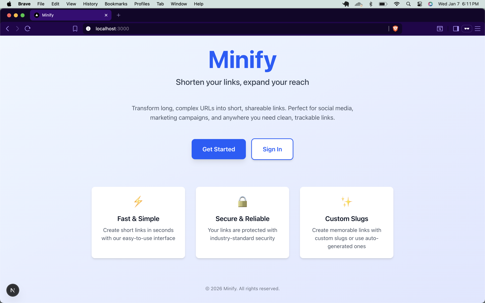
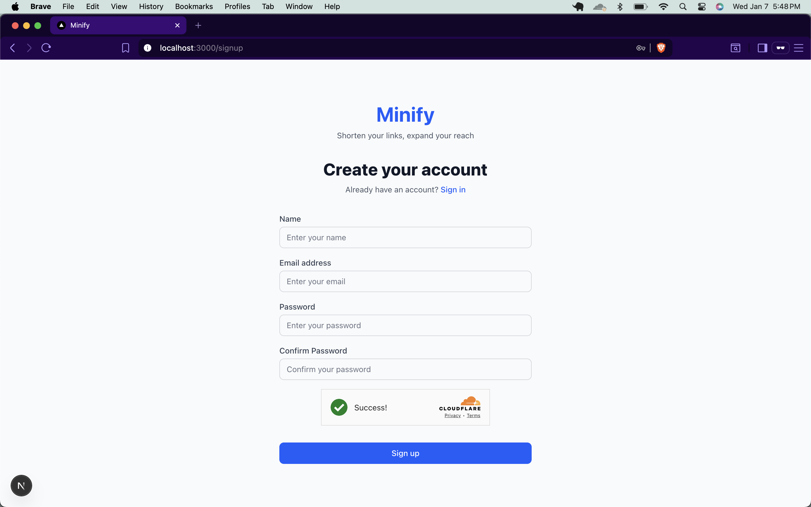
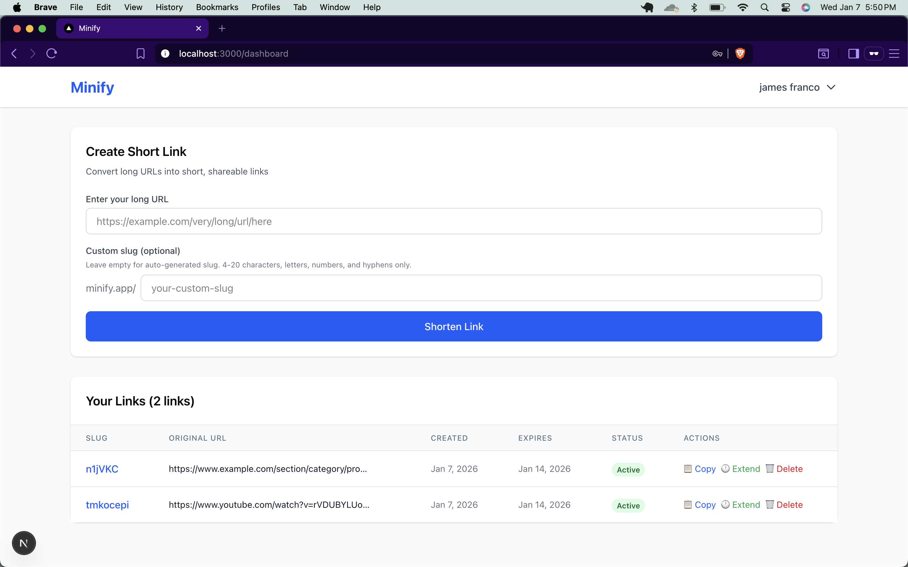
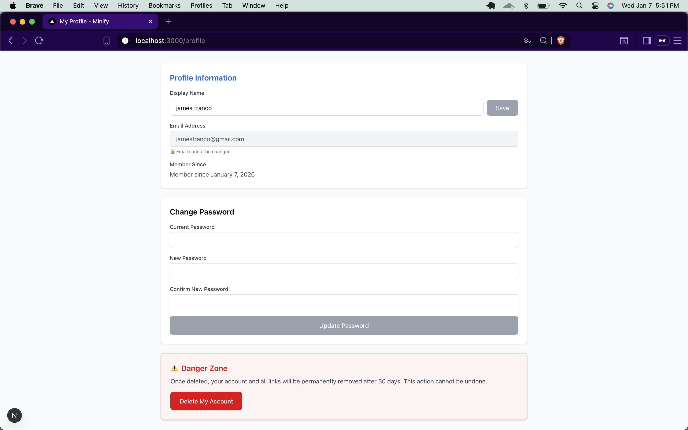

# Minify 🔗

> Shorten your links, expand your reach

[](LICENSE)
[](https://nextjs.org/)
[](https://supabase.com/)

---

## ✨ Features

- 🔐 **Secure Authentication** - Email/password auth with Cloudflare Turnstile CAPTCHA
- ⚡ **Custom or Auto-Generated Slugs** - Create memorable short links or let the system generate them
- ⏰ **Auto-Expiration** - Links automatically expire after 7 days (extendable)
- 📊 **Dashboard Management** - View, copy, extend, or delete your links
- 🔄 **Account Recovery** - 30-day soft delete with reactivation option
- 🛡️ **Row-Level Security** - Database-level security with Supabase RLS
- 🎨 **Clean UI** - Modern, responsive interface built with Tailwind CSS

---

## 🎥 Demo Video

> **[Watch the full demo on YouTube](https://youtu.be/0LQ5QRc3QVA)**

---

## 📸 Screenshots

<table>
  <tr>
    <td></td>
    <td></td>
  </tr>
  <tr>
    <td align="center"><b>Homepage</b></td>
    <td align="center"><b>Signup</b></td>
  </tr>
  <tr>
    <td></td>
    <td></td>
  </tr>
  <tr>
    <td align="center"><b>Login</b></td>
    <td align="center"><b>Dashboard</b></td>
  </tr>
  <tr>
    <td colspan="2" align="center">
      
    </td>
  </tr>
  <tr>
    <td colspan="2" align="center"><b>Profile Management</b></td>
  </tr>
</table>

---

## 🛠️ Tech Stack

- **Framework:** [Next.js 14](https://nextjs.org/) (App Router)
- **Database:** [Supabase](https://supabase.com/) (PostgreSQL)
- **Authentication:** Supabase Auth
- **Styling:** Tailwind CSS
- **Language:** TypeScript
- **CAPTCHA:** Cloudflare Turnstile
- **Deployment:** Vercel (recommended)

---

## 🚀 Quick Start

### Prerequisites

- Node.js 18+ and npm
- Supabase account
- Cloudflare Turnstile account (free)

### Installation

1. **Clone the repository**
   ```bash
   git clone https://github.com/janki2709/minify.git
   cd minify
   ```

2. **Install dependencies**
   ```bash
   npm install
   ```

3. **Set up environment variables**
   ```bash
   cp .env.example .env.local
   ```
   Fill in your Supabase and Turnstile credentials in `.env.local`

4. **Set up the database**
   - Go to your Supabase project dashboard
   - Run the SQL files in the `sql/` folder in order (01 through 05)
   - See [SETUP.md](SETUP.md) for detailed instructions

5. **Run the development server**
   ```bash
   npm run dev
   ```

6. **Open your browser**
   Navigate to `http://localhost:3000`

---

## 📖 Detailed Setup Guide

For step-by-step instructions including:
- Creating a Supabase project
- Setting up database tables, RLS policies, triggers, and cron jobs
- Configuring Cloudflare Turnstile
- Troubleshooting common issues

See **[SETUP.md](SETUP.md)**

---

## 🔒 Security Features

- ✅ Password hashing (handled by Supabase)
- ✅ HTTP-only cookies for session management
- ✅ Row-Level Security (RLS) policies
- ✅ CAPTCHA protection on auth endpoints
- ✅ Input validation and sanitization
- ✅ Protected routes via middleware
- ✅ Reserved slug validation

---

## 🎯 Key Features Explained

### Link Management
- **Custom Slugs:** 4-20 characters, alphanumeric + hyphens
- **Auto-Generated Slugs:** 5-6 character random strings
- **Expiration:** Default 7 days, extendable by 7 more days
- **Validation:** Reserved slugs (like 'admin', 'api') are blocked

### Account Management
- **Soft Delete:** 30-day grace period for account recovery
- **Hard Delete:** Automatic cleanup after 30 days via cron job
- **Reactivation:** Login within 30 days to restore account
- **Profile:** Update display name and password

### Background Jobs
- **Expired Links Cleanup:** Runs daily at 2:00 AM UTC
- **Account Deletion:** Removes soft-deleted accounts after 30 days

---

## 🚧 Known Limitations (MVP)

- No click analytics or tracking
- No search/filter on dashboard
- No QR code generation
- Fixed 7-day expiration (not customizable)
- Cannot edit links after creation
- No forgot password functionality
- No social sign-on (SSO)

---

## 🛣️ Roadmap

See the project documentation for planned features including:
- Advanced analytics and click tracking
- Custom expiration periods
- QR code generation
- Link editing capabilities
- Team collaboration features
- Public API with webhooks
- Browser extensions

---

## 🤝 Contributing

Contributions are welcome! Please feel free to submit a Pull Request.

1. Fork the repository
2. Create your feature branch (`git checkout -b feature/AmazingFeature`)
3. Commit your changes (`git commit -m 'Add some AmazingFeature'`)
4. Push to the branch (`git push origin feature/AmazingFeature`)
5. Open a Pull Request

---

## 🙏 Acknowledgments

- [Next.js](https://nextjs.org/) - The React Framework
- [Supabase](https://supabase.com/) - Open source Firebase alternative
- [Cloudflare Turnstile](https://www.cloudflare.com/products/turnstile/) - Privacy-first CAPTCHA
- [Tailwind CSS](https://tailwindcss.com/) - Utility-first CSS framework